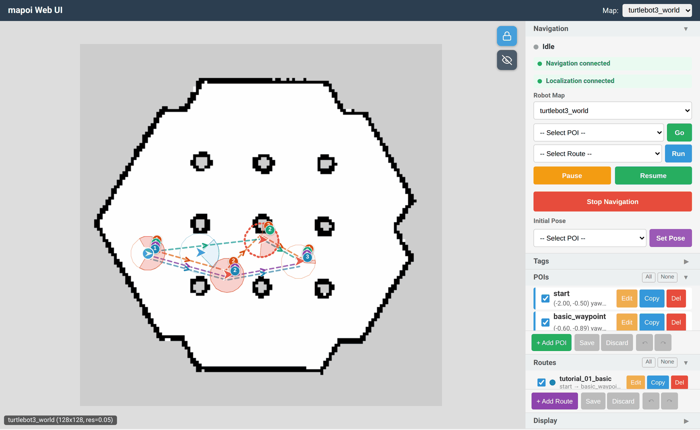
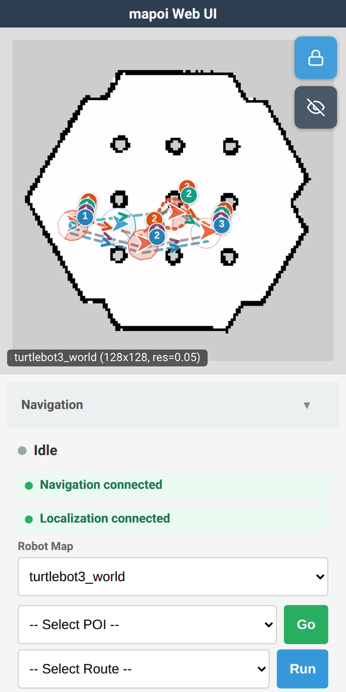
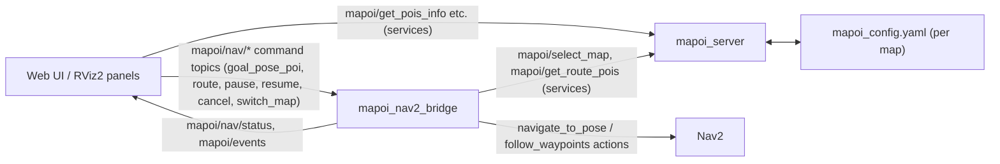

# mapoi

> English version (primary): [README.md](./README.md)
> 本ファイルは日本語スナップショットです。最新の内容は英語版を参照してください。

[](https://github.com/shimz-robotics/mapoi/actions/workflows/ros-test.yml)
[](https://github.com/shimz-robotics/mapoi/releases)
[](./LICENSE)
[](https://docs.ros.org/)

Navigation2 向けの地図（Map）と関心地点（POI: Point of Interest）を管理するメタパッケージです。
地図の切り替え、POI の管理、RViz2 GUI からの自律走行操作、POI 半径イベントの検知を提供します。

<p align="center">
  
  
</p>

*`turtlebot3_world` デモ実行中の Web UI（デスクトップ表示とスマートフォン表示）。*

## 主な機能

- **地図管理**: 複数地図の切り替え、Nav2 との連携
- **POI 管理**: YAML ベースの POI 定義、サービス経由での取得
- **自律走行**: POI 名指定でのゴール走行、ルート走行、一時停止・再開
- **POI 半径イベント**: POI の半径にロボットが侵入/退出した際のイベント発行
- **タグシステム**: システムタグ（`waypoint`, `landmark`, `pause`）とユーザー定義タグによる POI 分類
- **RViz2 GUI**: 地図切替・ゴール指定・ルート走行の操作パネル、POI エディタ、ポーズ指定ツール
- **Web UI**: ブラウザからの地図表示・POI 編集・ナビゲーション操作・ロボット位置表示（スマートフォン対応）
- **マーカー表示**: RViz2 上での POI 可視化、ハイライト表示、半径表示

## アーキテクチャ



上図は簡略版です (localization・RViz マーカー・status/event の詳細は省略)。ノード・topic・service の全体像は [docs/architecture.ja.md](./docs/architecture.ja.md) を参照してください。

## Docker quickstart

最速で試したい場合は ghcr.io 配布 image を `docker run`:

```sh
xhost +local:docker
docker pull ghcr.io/shimz-robotics/mapoi:jazzy   # jazzy/latest は main 追従のローリングタグ。再訪時も pull で最新化
docker run --rm -it --network host --ipc host \
  -e DISPLAY=$DISPLAY \
  -e QT_X11_NO_MITSHM=1 \
  -v /tmp/.X11-unix:/tmp/.X11-unix \
  ghcr.io/shimz-robotics/mapoi:jazzy
```

ブラウザで http://localhost:8765 にアクセス。Nav2 lifecycle 立ち上げに 30〜60 秒かかるので少し待ってから。WebUI が「Navigation unavailable」のままになる場合は [docs/docker.ja.md](./docs/docker.ja.md) のトラブルシューティングを参照してください。

Humble 版 / GPU 加速 / ソースビルド / 開発用 bind mount / UID 調整等の詳細は [docs/docker.ja.md](./docs/docker.ja.md) を参照してください。

## 動作要件

- ROS 2 Humble (Ubuntu 22.04) または Jazzy (Ubuntu 24.04)
- Nav2 ほか依存パッケージは `rosdep` で解決します（後述のビルド手順を参照）

## ビルドとサンプルの実行

```sh
source /opt/ros/<distro>/setup.bash   # humble または jazzy
# cd path/to/your_ws
git clone https://github.com/shimz-robotics/mapoi.git src/mapoi
rosdep update
rosdep install --from-paths src --ignore-src -r -y
colcon build --symlink-install
source install/setup.bash
export TURTLEBOT3_MODEL=burger
ros2 launch mapoi_turtlebot3_example turtlebot3_navigation.launch.yaml
```

ブラウザから Web UI にアクセス:

http://localhost:8765

スマートフォンからも同一ネットワーク内であればアクセスできます。その場合、localhostの部分を実行しているPCのIPアドレスに変更してください。
地図表示・POI 編集・ナビゲーション操作・ロボット位置表示が可能です。

コマンドで目的地を指定したい場合には、別ターミナルから自律走行をテストできます。

```sh
ros2 topic pub -1 /mapoi/nav/goal_pose_poi std_msgs/msg/String "{data: goal}"
```

## 自分のロボットへの導入

mapoi は Nav2 ベースのロボットであれば実機・シミュレーションを問わず利用できます。導入手順は [docs/integration.ja.md](./docs/integration.ja.md) を参照してください。

## パッケージ構成

| パッケージ | 説明 |
| --- | --- |
| [mapoi_server](./mapoi_server/) | 地図・POI 情報の管理サーバー、ナビゲーションサーバー、RViz2 マーカー配信（メインパッケージ） |
| [mapoi_interfaces](./mapoi_interfaces/) | メッセージ・サービスの定義 |
| [mapoi_rviz_plugins](./mapoi_rviz_plugins/) | RViz2 プラグイン（地図切替・POI 選択・自律走行の GUI、POI エディタ） |
| [mapoi_webui](./mapoi_webui/) | Web UI（ブラウザからの地図表示・POI 編集・ナビゲーション操作・ロボット位置表示） |
| [mapoi_turtlebot3_example](./mapoi_turtlebot3_example/) | TurtleBot3 シミュレーション環境でのサンプル |
| [mapoi](./mapoi/) | コアパッケージ一式を 1 つの単位でインストールするための metapackage 定義 (シミュレーション用の mapoi_turtlebot3_example は含まない。デモを試す場合は example を直接インストールするとコア一式も入る) |

## ドキュメント

| 用途 | リンク |
| --- | --- |
| 自分のロボットへの導入手順 | [docs/integration.ja.md](./docs/integration.ja.md) |
| Docker での demo / 開発環境 | [docs/docker.ja.md](./docs/docker.ja.md) |
| アーキテクチャ概要 (ノード・topic・service・データフロー) | [docs/architecture.ja.md](./docs/architecture.ja.md) |
| Navigation / Localization backend 仕様 (自前 bridge 実装者向け) | [docs/backend-status.ja.md](./docs/backend-status.ja.md) |
| コントリビューションガイド (開発環境・PR フロー) | [CONTRIBUTING.md](./CONTRIBUTING.md) |
| テスト追加ポリシー (致命核基準・launch_test/e2e 追加の判断) | [docs/testing-policy.md](./docs/testing-policy.md) |
| 破壊的変更リリースの migration ガイド | [docs/migration/README.ja.md](./docs/migration/README.ja.md) |
| 各リリースの破壊的変更詳細 | [`CHANGELOG.rst`](./CHANGELOG.rst) |

## バージョン方針 (SemVer)

本プロジェクトは現在 **v0.x の開発フェーズ** にあります。

- **v0.x 系**: API は安定していません。設計の見直しによる **破壊的変更が任意のリリースで発生する可能性** があります。各リリースの破壊的変更は [`CHANGELOG.rst`](./CHANGELOG.rst) と [GitHub Releases](https://github.com/shimz-robotics/mapoi/releases) で明示し、段階的な移行手順は [docs/migration/README.ja.md](./docs/migration/README.ja.md) にまとめます
- **v1.0.0 以降**: 公開 API (msg / topic / service / launch param / YAML schema 等) の後方互換性を保証します。破壊的変更は major バージョン bump (v2.0.0 等) で明示します

### 計画中の破壊的変更

計画中の破壊的変更を含む今後の予定は [GitHub Milestones](https://github.com/shimz-robotics/mapoi/milestones) を参照してください。

## ライセンス

MIT
