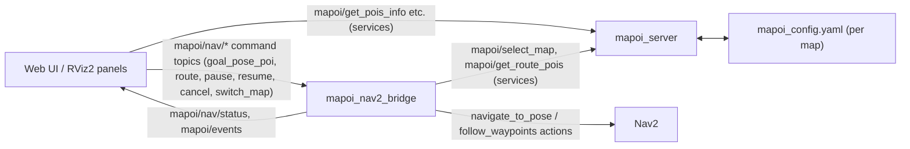

# mapoi

> Japanese version: [README.ja.md](./README.ja.md)

[](https://github.com/shimz-robotics/mapoi/actions/workflows/ros-test.yml)
[](https://github.com/shimz-robotics/mapoi/releases)
[](./LICENSE)
[](https://docs.ros.org/)

A metapackage for managing maps and POIs (Points of Interest) for Navigation2.
It provides map switching, POI management, autonomous navigation operation from the RViz2 GUI, and POI radius event detection.

<p align="center">
  
  
</p>

*Web UI running the `turtlebot3_world` demo (desktop and smartphone views).*

## Key features

- **Map management**: switching between multiple maps, integration with Nav2
- **POI management**: YAML-based POI definitions, retrieval via services
- **Autonomous navigation**: goal navigation by POI name, route navigation, pause/resume
- **POI radius events**: events fired when the robot enters/exits a POI's radius
- **Tag system**: POI classification via system tags (`waypoint`, `landmark`, `pause`) and user-defined tags
- **RViz2 GUI**: an operation panel for map switching, goal selection, and route navigation, a POI editor, and a pose-specification tool
- **Web UI**: map display, POI editing, navigation operation, and robot position display from a browser (smartphone-friendly)
- **Marker display**: POI visualization, highlighting, and radius display in RViz2

## Architecture



The diagram above is simplified (localization, RViz markers, and status/event details are omitted) — see [docs/architecture.md](./docs/architecture.md) for the full node/topic/service breakdown.

## Docker quickstart

For the fastest way to try it out, `docker run` the image distributed via ghcr.io:

```sh
xhost +local:docker
docker pull ghcr.io/shimz-robotics/mapoi:jazzy   # jazzy/latest is a rolling tag that tracks main; pull again on each revisit to get the latest
docker run --rm -it --network host --ipc host \
  -e DISPLAY=$DISPLAY \
  -e QT_X11_NO_MITSHM=1 \
  -v /tmp/.X11-unix:/tmp/.X11-unix \
  ghcr.io/shimz-robotics/mapoi:jazzy
```

Access http://localhost:8765 in your browser. Bringing up the Nav2 lifecycle takes about 30-60 seconds, so give it a moment. If the WebUI stays stuck on "Navigation unavailable", see the troubleshooting section in [docs/docker.md](./docs/docker.md).

See [docs/docker.md](./docs/docker.md) for details on the Humble variant, GPU acceleration, building from source, development bind mounts, UID adjustment, and more.

## Requirements

- ROS 2 Humble (Ubuntu 22.04) or Jazzy (Ubuntu 24.04)
- Nav2 and the other dependencies are resolved via `rosdep` (see the build steps below)

## Building and running the sample

```sh
source /opt/ros/<distro>/setup.bash   # humble or jazzy
# cd path/to/your_ws
git clone https://github.com/shimz-robotics/mapoi.git src/mapoi
rosdep update
rosdep install --from-paths src --ignore-src -r -y
colcon build --symlink-install
source install/setup.bash
export TURTLEBOT3_MODEL=burger
ros2 launch mapoi_turtlebot3_example turtlebot3_navigation.launch.yaml
```

Access the Web UI from a browser:

http://localhost:8765

You can also access it from a smartphone on the same network. In that case, replace `localhost` with the IP address of the PC running the demo.
It lets you view the map, edit POIs, operate navigation, and see the robot's position.

If you'd rather send a goal from the command line, you can test autonomous navigation from a separate terminal.

```sh
ros2 topic pub -1 /mapoi/nav/goal_pose_poi std_msgs/msg/String "{data: goal}"
```

## Integrating with your own robot

mapoi works with any Nav2-based robot, real or simulated. See [docs/integration.md](./docs/integration.md) for step-by-step integration instructions.

## Package composition

| Package | Description |
| --- | --- |
| [mapoi_server](./mapoi_server/) | Server that manages map/POI information, navigation server, RViz2 marker publisher (main package) |
| [mapoi_interfaces](./mapoi_interfaces/) | Message and service definitions |
| [mapoi_rviz_plugins](./mapoi_rviz_plugins/) | RViz2 plugins (GUI for map switching, POI selection, and autonomous navigation, plus a POI editor) |
| [mapoi_webui](./mapoi_webui/) | Web UI (map display, POI editing, navigation operation, and robot position display from a browser) |
| [mapoi_turtlebot3_example](./mapoi_turtlebot3_example/) | Sample for the TurtleBot3 simulation environment |
| [mapoi](./mapoi/) | Metapackage definition that installs the core packages as a single unit (does not include mapoi_turtlebot3_example, which is for simulation; installing the example package directly also pulls in the full core set if you just want to try the demo) |

## Documentation

| Purpose | Link |
| --- | --- |
| Integration steps for your own robot | [docs/integration.md](./docs/integration.md) |
| Docker demo / development environment | [docs/docker.md](./docs/docker.md) |
| Architecture overview (nodes, topics, services, data flow) | [docs/architecture.md](./docs/architecture.md) |
| Navigation / Localization backend spec (for custom bridge implementers) | [docs/backend-status.md](./docs/backend-status.md) |
| Contributing guide (development setup, PR flow) | [CONTRIBUTING.md](./CONTRIBUTING.md) |
| Test addition policy (criteria for critical-core coverage, decisions on adding launch_test/e2e tests) (Japanese) | [docs/testing-policy.md](./docs/testing-policy.md) |
| Migration guides for breaking-change releases | [docs/migration/](./docs/migration/) |
| Breaking-change details for each release | [`CHANGELOG.rst`](./CHANGELOG.rst) |

## Versioning policy (SemVer)

This project is currently in the **v0.x development phase**.

- **v0.x series**: The API is not yet stable. **Breaking changes may occur in any release** as the design evolves. Breaking changes for each release are documented in [`CHANGELOG.rst`](./CHANGELOG.rst) and [GitHub Releases](https://github.com/shimz-robotics/mapoi/releases), with step-by-step upgrade guides in [docs/migration/](./docs/migration/)
- **v1.0.0 and later**: Backward compatibility of the public API (msg / topic / service / launch params / YAML schema, etc.) is guaranteed. Breaking changes will be indicated by a major version bump (e.g., v2.0.0)

### Planned breaking changes

See [GitHub Milestones](https://github.com/shimz-robotics/mapoi/milestones) for upcoming plans, including any planned breaking changes.

## License

MIT
