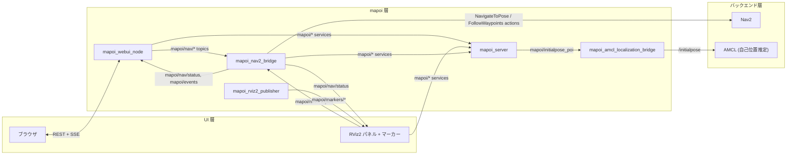
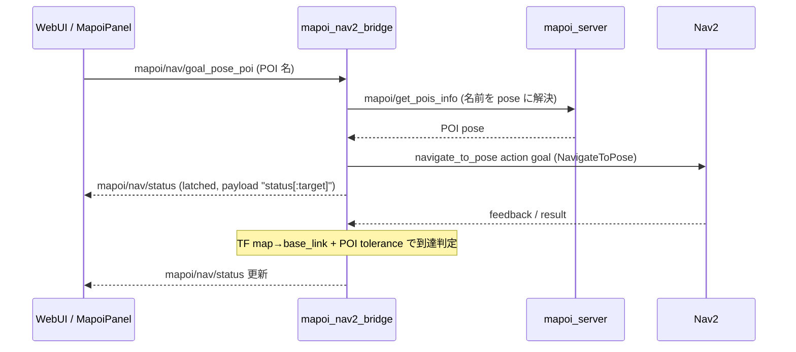
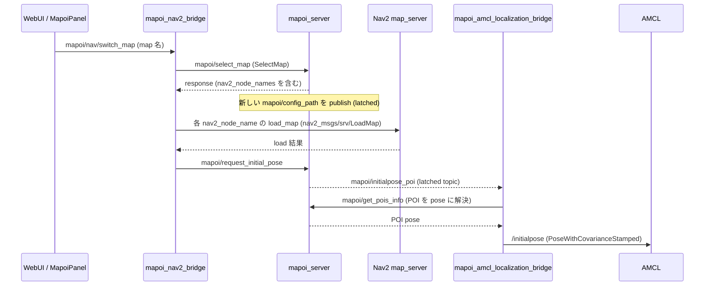

# アーキテクチャ

> English version (primary): [architecture.md](./architecture.md)

新規ユーザーと custom bridge 実装者向けに全体像を示すページ: どんなノードがあり、互いにどう通信し、Nav2 がどこに位置するか。

## 概要

mapoi は **Nav2 の上に「名前付き地点 (POI)」のレイヤ**を足します。生の座標を送る代わりに、オペレータはブラウザや RViz2 から「`entrance` へ行け」と指示し、mapoi が名前を解決して Nav2 を駆動し、進捗を UI に返します。複数マップの管理 (Nav2 のマップ切替と初期位置設定をワンセットで実行) と、route 走行中の POI 半径イベント発火も担います。

| パッケージ | 役割 |
| --- | --- |
| [mapoi_server](../mapoi_server/) | 中核ノード群: config/POI サーバ、Nav2 ブリッジ、AMCL ブリッジ、RViz2 マーカー配信、シミュレータブリッジ |
| [mapoi_interfaces](../mapoi_interfaces/) | 以下すべてが使う msg / srv 定義 |
| [mapoi_rviz_plugins](../mapoi_rviz_plugins/) | RViz2 操作パネル、POI エディタパネル、Pose ツール |
| [mapoi_webui](../mapoi_webui/) | ブラウザ UI (Flask + ROS 2 ノード) |
| [mapoi_turtlebot3_example](../mapoi_turtlebot3_example/) | TurtleBot3 デモ launch + 最小 example クライアント |
| [mapoi](../mapoi/) | メタパッケージ (ノードなし) |

真実のソースは `maps_path/<map>/mapoi_config.yaml` で、所有者は `mapoi_server`。他のノードはすべて `mapoi/*` service 経由で POI/route/tag データを取得します。

## ノード構成図

中核ノードと主要な通信経路 (詳細は[インターフェース一覧](#インターフェース一覧)):

システム全体を貫く latched (`transient_local`) topic は以下で、いずれも **writer は `mapoi_server` のみ**です:

- `mapoi/config_path` — 現在の map context の通知。変化すると各 mapoi ノードがデータを再取得する
- `mapoi/initialpose_poi` — 初期位置リクエスト。他ノードからは `mapoi/request_initial_pose` service 経由で発火する (#211)

バックエンドの健全性は `mapoi/nav/backend_status` と `mapoi/localization/backend_status` (1 Hz、`transient_local` + `MANUAL_BY_TOPIC` liveliness、lease 5 s) で通知され、UI 側はこれでボタンの有効/無効を切り替えます。

## 主要データフロー

### POI へ Go

オペレータが POI 名を選ぶと、`mapoi_nav2_bridge` が名前を解決して Nav2 を駆動します:

route 走行も同じ流れで `mapoi/nav/route` から入ります (`waypoint_arrival_mode` に応じて `FollowWaypoints` または `NavigateToPose` の繰り返し)。route 走行中に route 登録 POI へ進入/退出すると `mapoi_interfaces/msg/PoiEvent` (`EVENT_ENTER` / `EVENT_PAUSED` / `EVENT_EXIT`) が `mapoi/events` に publish され、reject されたコマンドは `mapoi/nav/command_rejected` で通知されます。

### map 切替

operator map switch は Nav2 のマップ差し替えとロボットの再 localization をワンセットで行います:

シミュレータブリッジ (後述) は `mapoi/config_path` の変化を独立に検知して仮想世界を入れ替えます。なお Web UI の*エディタ*側マップ選択 (`POST /api/editor/select-map`) は `mapoi/select_map` を呼ぶだけで Nav2 には触れません。フル切替は上記の `mapoi/nav/switch_map` 経路です。

## インターフェース一覧

中核ノードの全インターフェース。型はパッケージ表記がない限り `mapoi_interfaces` です。

### Topics

| Topic | 型 | Producer → Consumer | 特記 (QoS 等) |
| --- | --- | --- | --- |
| `mapoi/config_path` | `std_msgs/msg/String` | `mapoi_server` → 全 mapoi ノード、パネル、sim ブリッジ | `transient_local` depth 1 (latched)。map context 変更トリガ |
| `mapoi/initialpose_poi` | `msg/InitialPoseRequest` | `mapoi_server` (唯一の writer) → localization / sim ブリッジ | `transient_local` depth 1。発火は `mapoi/request_initial_pose` 経由 |
| `mapoi/nav/goal_pose_poi` | `std_msgs/msg/String` | WebUI, MapoiPanel → `mapoi_nav2_bridge` | POI 名、単発ゴール |
| `mapoi/nav/route` | `std_msgs/msg/String` | WebUI, MapoiPanel → `mapoi_nav2_bridge` | route 名 |
| `mapoi/nav/switch_map` | `std_msgs/msg/String` | WebUI, MapoiPanel, example クライアント → `mapoi_nav2_bridge` | map 名 (operator map switch) |
| `mapoi/nav/cancel` / `pause` / `resume` | `std_msgs/msg/String` | WebUI, MapoiPanel (resume は `camera_node` デモからも) → `mapoi_nav2_bridge` | |
| `mapoi/nav/status` | `std_msgs/msg/String` | `mapoi_nav2_bridge` → WebUI, MapoiPanel | `transient_local` depth 1。payload は `status[:target]` |
| `mapoi/nav/command_rejected` | `std_msgs/msg/String` | `mapoi_nav2_bridge` → WebUI | volatile depth 10。reject イベント (#354) |
| `mapoi/nav/backend_status` | `msg/NavigationBackendStatus` | `mapoi_nav2_bridge` → WebUI, MapoiPanel | 1 Hz。`transient_local` + `MANUAL_BY_TOPIC` liveliness、lease 5 s (#208) |
| `mapoi/localization/backend_status` | `msg/LocalizationBackendStatus` | `mapoi_amcl_localization_bridge` → WebUI, MapoiPanel | 上と同じ QoS contract |
| `mapoi/events` | `msg/PoiEvent` | `mapoi_nav2_bridge` → ユーザーノード (example ノード参照) | depth 10。`EVENT_ENTER`/`EVENT_PAUSED`/`EVENT_EXIT`、route 走行中のみ |
| `mapoi/markers/pois` / `mapoi/markers/routes` | `visualization_msgs/msg/MarkerArray` | `mapoi_rviz2_publisher` → RViz2 | 1 Hz。POI ラベル、tolerance 円/扇形、route 線 |
| `mapoi/highlight/goal` / `mapoi/highlight/route` | `std_msgs/msg/String` | MapoiPanel → `mapoi_rviz2_publisher` | 選択強調 |
| `mapoi_rviz_pose` | `geometry_msgs/msg/PoseStamped` | MapoiPoseTool → PoiEditorPanel | RViz 上のクリック&ドラッグによる pose 入力 |
| `/initialpose` | `geometry_msgs/msg/PoseWithCovarianceStamped` | `mapoi_amcl_localization_bridge` (と gazebo ブリッジ) → AMCL 等 | topic 名は param `initial_pose_topic`。subscriber 不在の間は再送 |
| `goal_pose` | `geometry_msgs/msg/PoseStamped` | `mapoi_nav2_bridge` → Nav2 | `NavigateToPose` action server 不在時の fallback のみ |
| `cmd_vel` | `geometry_msgs/msg/Twist` または `TwistStamped` | Nav2 controller → `mapoi_nav2_bridge` | param `cmd_vel_topic` / `cmd_vel_msg_type=auto` (Humble→Twist, Jazzy 以降→TwistStamped)。`EVENT_PAUSED` の停止判定用 |

### Services

server は `load_map` (Nav2) を除きすべて `mapoi_server`。型はパッケージ表記がない限り `mapoi_interfaces/srv/*` です。

| Service | 型 | Server | 主な caller |
| --- | --- | --- | --- |
| `mapoi/get_pois_info` | `GetPoisInfo` | `mapoi_server` | nav2 bridge, amcl bridge, rviz2 publisher, パネル, example クライアント |
| `mapoi/get_route_pois` | `GetRoutePois` | `mapoi_server` | nav2 bridge, rviz2 publisher, MapoiPanel |
| `mapoi/get_maps_info` | `GetMapsInfo` | `mapoi_server` | パネル, example クライアント |
| `mapoi/get_routes_info` | `GetRoutesInfo` | `mapoi_server` | rviz2 publisher, MapoiPanel |
| `mapoi/get_tag_definitions` | `GetTagDefinitions` | `mapoi_server` | nav2 bridge, WebUI, PoiEditorPanel |
| `mapoi/select_map` | `SelectMap` | `mapoi_server` | nav2 bridge (map switch), WebUI, PoiEditorPanel |
| `mapoi/request_initial_pose` | `RequestInitialPose` | `mapoi_server` | nav2 bridge (LoadMap 後), WebUI, MapoiPanel |
| `mapoi/reload_map_info` | `std_srvs/srv/Trigger` | `mapoi_server` | WebUI, PoiEditorPanel (yaml 保存後) |
| `<nav2_node_name>/load_map` | `nav2_msgs/srv/LoadMap` | Nav2 map_server (複数可) | nav2 bridge。node 名は `SelectMap` response 由来 |

`PoiEditorPanel` はこのほか parameters client で `mapoi_rviz2_publisher` の表示 parameter (`poi_label_format` / `route_display_mode` / `show_tolerance_sector`) をリモート変更します。

### Actions

`mapoi_nav2_bridge` は以下の Nav2 action server の client です:

| Action | 型 | Server | Client |
| --- | --- | --- | --- |
| `navigate_to_pose` | `nav2_msgs/action/NavigateToPose` | Nav2 | `mapoi_nav2_bridge` (単発ゴール), example クライアント |
| `follow_waypoints` | `nav2_msgs/action/FollowWaypoints` | Nav2 | `mapoi_nav2_bridge` (route, `waypoint_arrival_mode=nav2`), example クライアント |

### シミュレータ連動 (optional)

`mapoi_bringup.launch.yaml` の `simulator` 引数で起動。どちらも `mapoi/config_path` + `mapoi/initialpose_poi` を subscribe し、map 切替時に仮想世界を入れ替えます:

| ノード | 対象 | 呼び出し先 |
| --- | --- | --- |
| `mapoi_gazebo_bridge` (Humble) | Gazebo Classic | `spawn_entity` / `delete_entity` (`gazebo_msgs/srv`)。respawn 後に `/initialpose` を再 publish (#91) |
| `mapoi_gz_bridge` (Jazzy 以降) | gz-sim | `/world/<world>/create` / `remove` / `set_pose` (`ros_gz_interfaces/srv`、`ros_gz_bridge parameter_bridge` 経由)。ロボットは respawn せず teleport |

### example ノード (mapoi_turtlebot3_example)

各統合ポイントの最小クライアント: `audio_guide_node` (`mapoi/events` の `EVENT_ENTER` に反応)、`camera_node` (`EVENT_PAUSED` に反応して `mapoi/nav/resume` を publish)、`navigate_to_pose_client` / `follow_waypoints_client_node` (Nav2 action 直接クライアント)、`get_pois_info_client` / `get_maps_info_client` (one-shot service 呼び出し)、`mapoi_switch_map_client` (`mapoi/nav/switch_map` に publish)、`print_initialpose` (`/initialpose` の echo)。

## Web UI (REST / SSE)

`mapoi_webui_node` は Flask サーバ (デフォルトポート 8765) を内包する単一の Python ノードです。ブラウザは REST (`/api/pois`, `/api/routes`, `/api/nav/*`, ...) で操作し、SSE (`/api/events`) で push 更新を受け取ります。ノードはこれらを上記の `mapoi/nav/*` topic と `mapoi/*` service に変換します。`mapoi_config.yaml` は楽観ロック (`config_version`, #241) 付きで直接編集し、保存後に `mapoi/reload_map_info` を呼びます。endpoint 全一覧と UI の使い方は [`mapoi_webui/README.ja.md`](../mapoi_webui/README.ja.md) を参照。

## custom backend

デフォルトのバックエンドは Nav2 と AMCL ですが、両ブリッジは差し替え可能です: `mapoi/nav/*` topic contract (+ `backend_status` liveliness) を満たすノードは `mapoi_nav2_bridge` の代替になり、`mapoi/initialpose_poi` を消費するノードは `mapoi_amcl_localization_bridge` の代替になります。自作 bridge 実装の contract 全文は [バックエンド status 仕様](./backend-status.ja.md) を参照。mapoi をそのまま自機に組み込む手順は [自分のロボットへの導入方法](./integration.ja.md) を参照。
