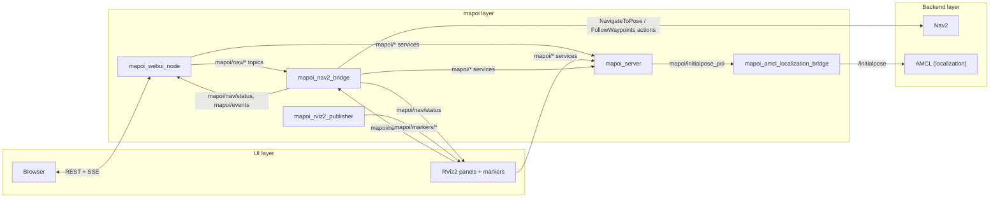
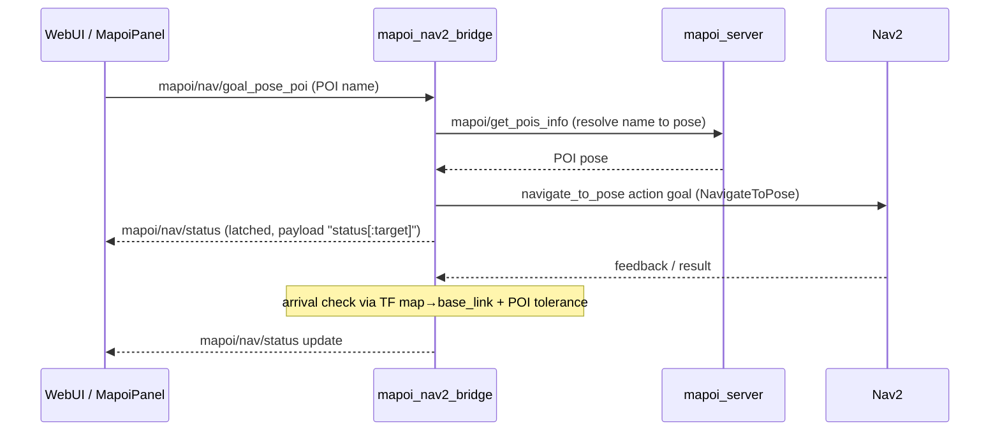
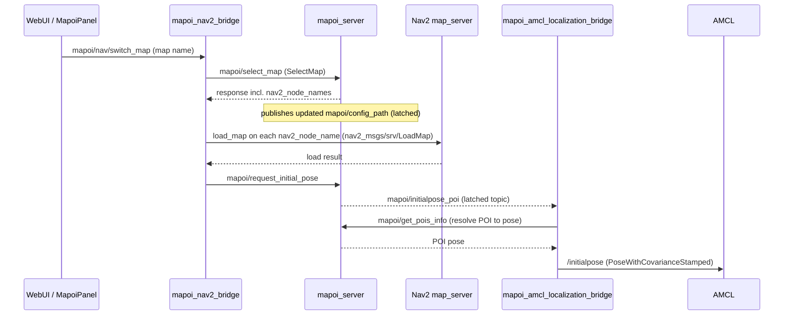

# Architecture

> Japanese version: [architecture.ja.md](./architecture.ja.md)

This page gives new users and custom-bridge implementers the big picture: which nodes exist, how they talk to each other, and where Nav2 fits in.

## Overview

mapoi adds a **named-place (POI) layer on top of Nav2**: instead of sending raw coordinates, operators say "go to `entrance`" from a browser or RViz2, and mapoi resolves the name, drives Nav2, and reports progress back. It also manages multiple maps (switching Nav2's map and the initial pose together) and fires events when the robot enters POI radii on a route.

| Package | Role |
| --- | --- |
| [mapoi_server](../mapoi_server/) | Core nodes: config/POI server, Nav2 bridge, AMCL bridge, RViz2 marker publisher, simulator bridges |
| [mapoi_interfaces](../mapoi_interfaces/) | msg / srv definitions used by everything below |
| [mapoi_rviz_plugins](../mapoi_rviz_plugins/) | RViz2 operator panel, POI editor panel, pose tool |
| [mapoi_webui](../mapoi_webui/) | Browser UI (Flask + ROS 2 node) |
| [mapoi_turtlebot3_example](../mapoi_turtlebot3_example/) | TurtleBot3 demo launch + minimal example clients |
| [mapoi](../mapoi/) | Metapackage (no nodes) |

The single source of truth is `maps_path/<map>/mapoi_config.yaml`, owned by `mapoi_server`. Everything else fetches POI/route/tag data through `mapoi/*` services.

## Node graph

Core nodes and the main communication paths (details in the [Interface reference](#interface-reference)):

The following latched (`transient_local`) topics glue the system together; `mapoi_server` is the **only writer** of each:

- `mapoi/config_path` — announces the current map context; every mapoi node re-fetches its data when it changes
- `mapoi/initialpose_poi` — initial-pose requests; other nodes trigger it via the `mapoi/request_initial_pose` service (#211)

Backend health is reported on `mapoi/nav/backend_status` and `mapoi/localization/backend_status` (1 Hz, `transient_local` + `MANUAL_BY_TOPIC` liveliness, 5 s lease), which the UIs use to enable/disable buttons.

## Main data flows

### Go to a POI

The operator picks a POI name; `mapoi_nav2_bridge` resolves it and drives Nav2:

Route driving works the same way via `mapoi/nav/route` (`FollowWaypoints` or repeated `NavigateToPose`, per `waypoint_arrival_mode`). While driving a route, entering/leaving a route-registered POI publishes `mapoi_interfaces/msg/PoiEvent` (`EVENT_ENTER` / `EVENT_PAUSED` / `EVENT_EXIT`) on `mapoi/events`; rejected commands are reported on `mapoi/nav/command_rejected`.

### Map switch

An operator map switch replaces the Nav2 map and re-localizes the robot in one shot:

The simulator bridges (below) watch `mapoi/config_path` independently and swap the simulated world to match. Note that the Web UI's *editor* map selection (`POST /api/editor/select-map`) only calls `mapoi/select_map` and does **not** touch Nav2 — the full switch is the `mapoi/nav/switch_map` path above.

## Interface reference

All interfaces of the core nodes. Types are `mapoi_interfaces` unless another package is shown.

### Topics

| Topic | Type | Producer → Consumer | Notes (QoS etc.) |
| --- | --- | --- | --- |
| `mapoi/config_path` | `std_msgs/msg/String` | `mapoi_server` → all mapoi nodes, panels, sim bridges | `transient_local` depth 1 (latched); map-context change trigger |
| `mapoi/initialpose_poi` | `msg/InitialPoseRequest` | `mapoi_server` (sole writer) → localization / sim bridges | `transient_local` depth 1; written via `mapoi/request_initial_pose` |
| `mapoi/nav/goal_pose_poi` | `std_msgs/msg/String` | WebUI, MapoiPanel → `mapoi_nav2_bridge` | POI name, single goal |
| `mapoi/nav/route` | `std_msgs/msg/String` | WebUI, MapoiPanel → `mapoi_nav2_bridge` | route name |
| `mapoi/nav/switch_map` | `std_msgs/msg/String` | WebUI, MapoiPanel, example client → `mapoi_nav2_bridge` | map name (operator map switch) |
| `mapoi/nav/cancel` / `pause` / `resume` | `std_msgs/msg/String` | WebUI, MapoiPanel (resume also from `camera_node` demo) → `mapoi_nav2_bridge` | |
| `mapoi/nav/status` | `std_msgs/msg/String` | `mapoi_nav2_bridge` → WebUI, MapoiPanel | `transient_local` depth 1; payload `status[:target]` |
| `mapoi/nav/command_rejected` | `std_msgs/msg/String` | `mapoi_nav2_bridge` → WebUI, MapoiPanel | volatile depth 10; reject events (#354, #398) |
| `mapoi/nav/backend_status` | `msg/NavigationBackendStatus` | `mapoi_nav2_bridge` → WebUI, MapoiPanel | 1 Hz; `transient_local` + `MANUAL_BY_TOPIC` liveliness, 5 s lease (#208) |
| `mapoi/localization/backend_status` | `msg/LocalizationBackendStatus` | `mapoi_amcl_localization_bridge` → WebUI, MapoiPanel | same QoS contract as above |
| `mapoi/events` | `msg/PoiEvent` | `mapoi_nav2_bridge` → MapoiPanel, user nodes (see example nodes) | depth 10; `EVENT_ENTER`/`EVENT_PAUSED`/`EVENT_EXIT`, route driving only |
| `mapoi/markers/pois` / `mapoi/markers/routes` | `visualization_msgs/msg/MarkerArray` | `mapoi_rviz2_publisher` → RViz2 | 1 Hz; POI labels, tolerance circles/sectors, route lines |
| `mapoi/highlight/goal` / `mapoi/highlight/route` | `std_msgs/msg/String` | MapoiPanel → `mapoi_rviz2_publisher` | highlight selection |
| `mapoi_rviz_pose` | `geometry_msgs/msg/PoseStamped` | MapoiPoseTool → PoiEditorPanel | pose input by click & drag in RViz |
| `/initialpose` | `geometry_msgs/msg/PoseWithCovarianceStamped` | `mapoi_amcl_localization_bridge` (and gazebo bridge) → AMCL etc. | topic name via param `initial_pose_topic`; retried while it has no subscriber |
| `goal_pose` | `geometry_msgs/msg/PoseStamped` | `mapoi_nav2_bridge` → Nav2 | fallback only when the `NavigateToPose` action server is absent |
| `cmd_vel` | `geometry_msgs/msg/Twist` or `TwistStamped` | Nav2 controller → `mapoi_nav2_bridge` | params `cmd_vel_topic` / `cmd_vel_msg_type=auto` (Humble→Twist, Jazzy+→TwistStamped); stop-dwell detection for `EVENT_PAUSED` |

### Services

All servers live in `mapoi_server` except `load_map` (Nav2). Types are `mapoi_interfaces/srv/*` unless shown.

| Service | Type | Server | Main callers |
| --- | --- | --- | --- |
| `mapoi/get_pois_info` | `GetPoisInfo` | `mapoi_server` | nav2 bridge, amcl bridge, rviz2 publisher, panels, example client |
| `mapoi/get_route_pois` | `GetRoutePois` | `mapoi_server` | nav2 bridge, rviz2 publisher, MapoiPanel |
| `mapoi/get_maps_info` | `GetMapsInfo` | `mapoi_server` | panels, example client |
| `mapoi/get_routes_info` | `GetRoutesInfo` | `mapoi_server` | rviz2 publisher, MapoiPanel |
| `mapoi/get_tag_definitions` | `GetTagDefinitions` | `mapoi_server` | nav2 bridge, WebUI, PoiEditorPanel |
| `mapoi/select_map` | `SelectMap` | `mapoi_server` | nav2 bridge (map switch), WebUI, PoiEditorPanel |
| `mapoi/request_initial_pose` | `RequestInitialPose` | `mapoi_server` | nav2 bridge (after LoadMap), WebUI, MapoiPanel |
| `mapoi/reload_map_info` | `std_srvs/srv/Trigger` | `mapoi_server` | WebUI, PoiEditorPanel (after saving yaml) |
| `<nav2_node_name>/load_map` | `nav2_msgs/srv/LoadMap` | Nav2 map_server(s) | nav2 bridge; node names come from the `SelectMap` response |

`PoiEditorPanel` additionally sets `mapoi_rviz2_publisher` display parameters (`poi_label_format` / `route_display_mode` / `show_tolerance_sector`) remotely via a parameters client.

### Actions

`mapoi_nav2_bridge` is a client of the following Nav2 action servers:

| Action | Type | Server | Client |
| --- | --- | --- | --- |
| `navigate_to_pose` | `nav2_msgs/action/NavigateToPose` | Nav2 | `mapoi_nav2_bridge` (single goal), example client |
| `follow_waypoints` | `nav2_msgs/action/FollowWaypoints` | Nav2 | `mapoi_nav2_bridge` (route, `waypoint_arrival_mode=nav2`), example client |

### Simulator integration (optional)

Started by `mapoi_bringup.launch.yaml` via the `simulator` argument. Both subscribe `mapoi/config_path` + `mapoi/initialpose_poi` and swap the simulated world on map switch:

| Node | Target | Calls |
| --- | --- | --- |
| `mapoi_gazebo_bridge` (Humble) | Gazebo Classic | `spawn_entity` / `delete_entity` (`gazebo_msgs/srv`); re-publishes `/initialpose` after respawn (#91) |
| `mapoi_gz_bridge` (Jazzy+) | gz-sim | `/world/<world>/create` / `remove` / `set_pose` (`ros_gz_interfaces/srv`, via `ros_gz_bridge parameter_bridge`); robot is teleported, not respawned |

### Example nodes (mapoi_turtlebot3_example)

Minimal clients showing each integration point: `audio_guide_node` (reacts to `EVENT_ENTER` on `mapoi/events`), `camera_node` (reacts to `EVENT_PAUSED`, then publishes `mapoi/nav/resume`), `navigate_to_pose_client` / `follow_waypoints_client_node` (direct Nav2 action clients), `get_pois_info_client` / `get_maps_info_client` (one-shot service calls), `mapoi_switch_map_client` (publishes `mapoi/nav/switch_map`), `print_initialpose` (echoes `/initialpose`).

## Web UI (REST / SSE)

`mapoi_webui_node` is a single Python node hosting a Flask server (default port 8765). The browser talks REST (`/api/pois`, `/api/routes`, `/api/nav/*`, ...) and receives push updates over SSE (`/api/events`); the node translates these to the `mapoi/nav/*` topics and `mapoi/*` services listed above. It edits `mapoi_config.yaml` directly with optimistic locking (`config_version`, #241) and calls `mapoi/reload_map_info` after saving. For the full endpoint list and UI usage, see [`mapoi_webui/README.md`](../mapoi_webui/README.md).

## Custom backends

Nav2 and AMCL are the default backends, but both bridges are replaceable: any node that speaks the `mapoi/nav/*` topic contract (plus `backend_status` liveliness) can replace `mapoi_nav2_bridge`, and any node consuming `mapoi/initialpose_poi` can replace `mapoi_amcl_localization_bridge`. The full contract for implementing your own bridge is specified in [docs/backend-status.md](./backend-status.md). For wiring mapoi into your robot as-is, see [docs/integration.md](./integration.md).
